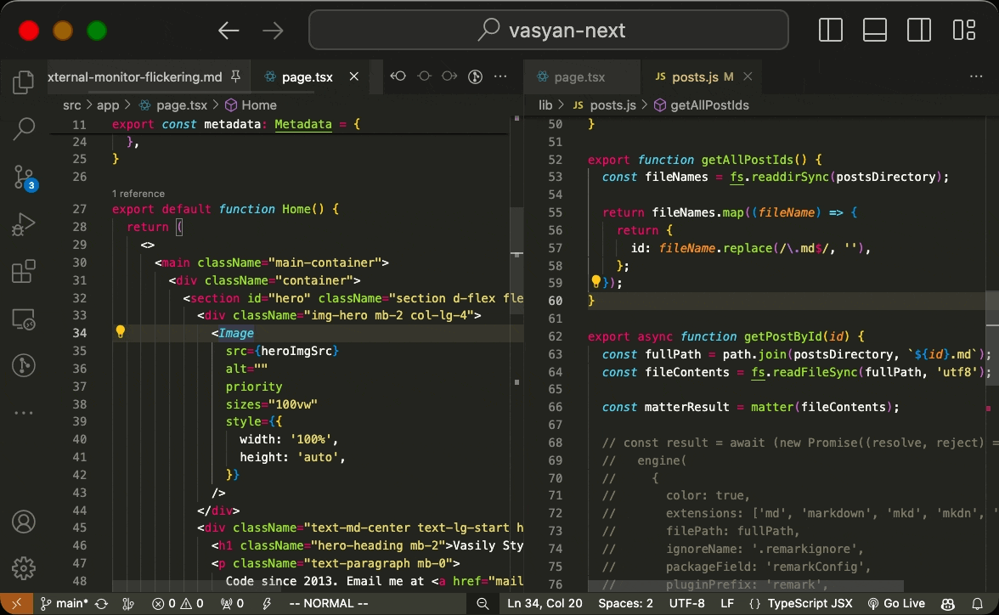

## Motivation

Currently, there is no option to disable rotation through open tabs in VSCode.
This extension is designed to disable this behavior.

## Demo

## Sales pitch

Switching between tabs has never been such a rotation-free experience before! With this extension, you will enjoy tab group borders and never be kicked from its end to the beginning and vice versa. Enjoy a smooth experience reminiscent of the good old days when interfaces had limitations.

## Setup

1. Preferences: Open Keyboard Shortcuts
2. Search for `please-no-rotation-tab-switching`. Set a proper shortcut to corresponding commands
